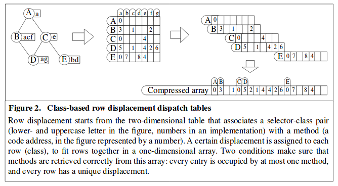

# Chapter 2
## Program Text to Tokens - Lexical Analysis

The front-end of a compiler starts with a stream of characters which constitute the program text, and creates from this stream intermediate code that allows context handling and translation into target code. It does this by obtaining the syntactic structure of the code by parsing the program according to the grammar of the language.

The syntactic analysis of the program produces a syntax tree, which usually contains too much useless information, and so a cleaned up version of the syntax tree, called the abstract syntax tree (AST) is usually used instead. The distinction between the syntax tree and the AST is a practical one, and the decision about what to include in the AST is left to the compiler engineer.

An alternative to ASTs is described in Waddle, 1990. A *production tree* is a tree of production nodes; the grammar symbols have no representation apart from their position in a production's RHS. A production tree can be represented with the following data structure:

``` C
typedef struct ProdTreeNode {
    int ProdNo;             // The index of the production.
    ProdTreeNode* Parent;   // Pointer to the parent node in the tree.
    ParsePtr Child[1];      // Variable-length array of pointers to node's child (rhs) nodes.
} ProdTreeNode;
```

### 2.1 Reading the program text

Reading and lexing the program text can be one of the more time-consuming parts of the compiler, so the textbook focusses more on efficiency here than it does in other sections.

The first thing to note is that on comtemporary systems with large amounts of memory, loading the entire file into memory at once is generally advisable. This reduces the complexity of the lexer, because we don't have to factor in the boundaries between tokens when reading in the file. We can also use the file to report context in error messages. 

Newlines are one particular annoyance when reading in files to the lexer. Each operating system has a different convention about what a newline is. In UNIX-based systems, the newline convention is a single character, LF, with value 0x0A ('\n'). On DOS-based systems, OS/2, Symbian, Palm OS, and others, the convention is two characters, CR LF, with value 0x0D 0x0A ('\r\n'). On Commodore, Acorn, ZX Specturum, Apple II and classic Mac OS systems, the convention is simply CR. Therefore, it is a good idea to convert all line ending characters to a fixed internal format as soon as possible.

### 2.2 Lexical versus syntactic analysis

The line between lexical and syntactic analysis is not as obvious as it seems. What is a token? Given an assignment operator `:=`, if the `:` and the `=` can stand apart from each other, then they are separate tokens. If they can't, then they are a single token. Comments and whitespace are generally not tokens (except in, say, Python), but it may be useful to preserve them, in order to show the program text surrounding an error.

### 2.3 Regular expressions and regular descriptions

*Regular expressions* are one way of describing tokens formally. A regular expression is a formula that describes a possibly infinite set of strings, in much the same way as a grammar. When we have a string that can be generated by a particular regular expression, we say that the regular expression *matches* the string.

| Basic Pattern | Matching string                           |
|---------------|-------------------------------------------|
| x             | The character x                           |
| .             | Any character (usually except a newline)  |
| R?            | 0 or 1 Rs.                                |
| R*            | 0 or more Rs                              |
| R+            | 1 or more Rs                              |
| RS            | R followed by S                           |
| R\|S          | R or S                                    |
| (R)           | R itself (group)                          |

The most basic regular expressions are a single character which matches just that character, e.g. the pattern `a` which just matches the string 'a'.

Basic patterns can be followed with repetition and composition operators. Parentheses can be used for grouping. The expression `ab*|cd?` is equivalent to `(a(b*))|(c(d?))`.

To match charactes like |, ?, *, and + that are part of the regular expression itself, generally we use escape characters, which are the characters prefixed with a `\`.

### 2.4 Lexical Analysis

Each token in the source language can therefore be sepcified in terms of a regular expression (or 'regular description'). The combination of a regular expression and the token name is called the *token description*. The task of the lexical analyser is to determine which of the regular expressions in S will match a segment of the input starting a P, where S is a set of token descriptions, and P is a position in the input stream. If there is more than one possible match, the lexer needs a disambiguating rule. Typically, the longest match is chosen; this is known as the *maximal-match rule*.

### 2.5 Creating a lexical analyzer by hand

Lexical analysers can be written by hand or generated automatically based on the specification of tokens through regular expressions. It is pretty easy to write a lexer by hand. Probably the best way to start is with a case statement over the first character of the input. The first characters of the tokens are different, and a case statement will subdivide the lexical analysis into smaller subproblems.

For different types of tokens, often the input will be from a finite set and the result will depend on the input only, which is a prime opportunity for *precomputation*. We compute all the answers in advance and then store them in an array, which means we can check the answers using only an array lookup.

### 2.6 Creating a lexical analyzer automatically

We can also generate a lexical analyzer. The textbook describes the techniques behind this in detail. I have no particular interest in writing a lexer generator, so I have skipped this section for now. (For writing programming language lexers, such a degree of generality is unnecessary.)

### 2.7 Transition table compression

Transition tables in lexical analysers are not ordinary, arbitrary matrices. They exhibit a high degree of structure. When a token is being recognized, only very few characters will continue that token, so most entries in the table are empty.

- A low density transition table is called *sparse*. Densities of less than 5% are not unusual.

#### 2.7.1 Table compression by row displacement

The first algorithm that we will look at to compress a transition table is called the *row displacement* algorithm. We use this algorithm to get rid of all of the empty entries in the table. Essentially, we cut the 2D transition matrix up into 'strips', and paste those strips together into an overlapping 1D array. We can then translate from this 1D array back to the 2D array while still getting extremely fast lookup times.

The textbook doesn't do a great job of conceptually explaining this. The diagram below is an explanation of the algorithm from the perspective of message dispatching tables for dynamically-typed languages. It appears in *Minimizing Row Displacement Dispatch Tables* (Driesen & Hölzle, 1995).



The diagram shows a class hierarchy. Each uppercase letter is a class, and each class understands the messages given in lowercase at its own node and at all of its parent nodes. Class D objects, for instance, understand messages a, g, c, f, and e. Provided this structure is fixed at runtime, we can precalculate it into a table. This table can then be translated into a compressed 1D array with few empty elements.

We can perform the compression by shifting each row a different amount until there is only one occupied entry on each column and then collapsing that structure down into a 1D array. Unfortunately, the process of finding the row displacements is an NP-complete problem. We have to resort to heuristics to find good (but sub-optimal) solutions.

One good heuristic is to sort the rows according to density, with the most dense first, and then we find the first place that each row fits.

#### 2.7.2 Table compression by graph coloring

*Graph coloring* is another technique to achieve the same goal. In this approach, we select a subset S from the total set of rows, such that we can combine all rows in S without displacement or conflict; they can all be placed in the same location.

- In a large-enough table we can find many such subsets that result in packings without any empty entries, an optimal packing.

The sets are determined by first constructing and then coloring a so-called *interference graph*, a graph in which each row is a node, and in which there is an egde between each pair of rows that cannot co-exist because of conflicts.

We can then color the graph (almost) optimally by assigning colors to each of its nodes such that no two nodes that are connected by an edge have the same color. This is an NP-complete problem, but we have good heuristic algorithms to find the minimal number of colors needed to fulfill the condition. These heuristics will be covered later.

### 2.8 Error handling in lexical analysers

This section discusses error handling. Mostly it points out that there should be additional regular expressions in the lexer to cover common patterns in incorrect programs.

### 2.9 A traditional lexer analyzer generator—lex

*Lex* is a classic UNIX program that generates lexers. Lex files are divided into three sections:

- The definition section defines macros and imports header files written in C.
- The rules section associates regular expression patterns with C statements.
- The C code section contains C statemenets and functions that are copied to the generated source file.

Lex generates a function, yylex(), which can be called to lex tokens. yylex() contains a loop which will continue lexing tokens until a return statement is encountered.

### 2.10 Lexical identification of tokens

In a cleanly-designed compiler, the only job of a lexical analyzer is to isolate the text of a token and identify the token class. The lexer should yield a stream of (token class, token representation) pairs. However, there are instances when the lexical analyzer might be the best place to do certain types of computations: for example, converting a numeric literal in octal or hexadecimal format into a stored integer.

The *lexer hack* is an example of this phenomenon. In C, classifying a sequence of characters as a variable name or as a type name requires contextual information, which prevents the lexer from being context free. For example:

```
(A)*B
```

could be multiplication of two variables, or it could be casting `*B` to type `A`.

Because of bad language design of this sort, we have to break the clean design of our lexers. Another example is macros: do we do macro processing before we perform lexical analysis, or do we integrate macro expansion into the lexer?

Another consideration is keywords. Most languages have a set of reserved words that look like identifiers but in fact serve a syntactic purpose.

In order to solve the above problems, it is often a good idea to do some identifier identification in the lexical analyzer, just enough to serve the purposes of the lexical analyzer and the parser. Effectively, we introduce a separate phase between the lexical analyzer and the parser, which we call the *lexical identification phase* or *screening*.

### 2.11 Symbol tables

A *symbol table* (or *name list*) is a mapping from an identifier onto an associated record which contains collected information about the identifier. The name 'symbol table' derives from the fact that identifiers are also called 'symbols', and that the mapping is often implemented using a hash table.

The primary interface of a symbol table is a single function, taking a name as input and returning a pointer to information about that name.

### 2.12 Macro processing and file inclusion

*This section of the textbook mainly concerns C-style textual-replacement macros, which can be powerful but are annoying to implement and use. I have no interest in writing a C compiler, so I have skipped most of this chapter. Haxe, for example, includes macros as part of its ordinary syntax; macro expressions modify the AST at compile-time.*

A *macro definition* identifies an indentifier as being a macro and having a certain string as a value. When the identifier is encountered in the program text, its string value is to be substituted in its place. A macro definition can have parameters, which can be substituted in its place.

Apart from macro substitution and parameter substitution, some languages define a third type of macro, file inclusion. A file inclusion directive contains a filename, which is retrieved from the system and substituted into the file inclusion directive.

Another type of macro to consider are macros for conditional compilation. A condition is evaluated at compile-time and the enclosed block of code is included (or not) as part of the subsequent compilation.

