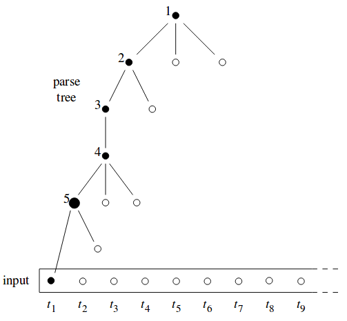
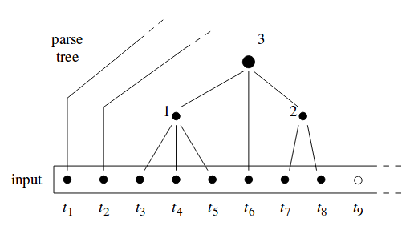

# Chapter 3
## Tokens to Syntax Tree - Syntax Analysis

The process of finding the structure in a flat stream of tokens is called *parsing*. There are two major ways of doing parsing: top-down, and bottom-up.

### 3.1 Two classes of parsing methods

A *parsing method* constructs the syntax tree for a given sequence of tokens.

- This entails constructing a syntax tree of nodes and labelling the nodes with grammar symbols.
- Leaf nodes should be labelled with terminals, and inner nodes should be labelled with non-terminals. 
- The top node should be labelled with the start symbol.
- The terminals labelling the lead nodes should correspond to the sequence of tokens, in the same order they appear in the input.

Left-to-right parsing starts with the first few tokens of the input and a syntax tree that consists of the top node only, labelled with the start symbol. The parsing methods can be distinguished by the order in which they construct the nodes of the syntax tree.

To traverse a tree in *pre-order* is to visit the node and then all of its subtrees; the corollary is *post-order*; visiting the subtrees before the node. 

- The *top-down* parsing method constructs the syntax tree in pre-order, i.e. starting at the top and constructing the tree downwards.
- The *bottom-up* parsing method constructs the syntax tree in post-order, i.e. by combining the tokens in the input into parts of the tree which are finally assembled together.

#### 3.1.1 Principles of top-down parsing

The top-down parser proceeds to construct the first child of the parse tree; note that it already knows its label. The process of determining the correct alternative for the leftmost child is repeated on the further levels, until a leftmost child is constructed that is a terminal symbol. The first token in the input is then matched by the parser, and the process continues to the right.

#### 3.1.2 Principles of bottom-up parsing

The bottom-up process of parsing constructs the nodes in the syntax tree in post-order, meaning that the top of a subtree is constructed after all of its lower nodes have been constructed. The children of the first subtree to be chosen are leaf nodes only, and then the tree is constructed upwards from there.

### 3.2 Error detection and error recovery

One thing to consider is when a user makes a syntax error. We actually want to be able to continue parsing the rest of the program in order to give the user all of the errors at once so they can fix them in one go before recompiling. In order to accomplish this, we need to be able to detect syntax errors and then recover from them, continuing to parse the rest of the program.

There are two strategies for error recovery: 

- *Error correction*, in which we fix up the parse tree and then continue parsing; this can cause many spurious error messages if the parse tree is broken in a particularly annoying way.
- *Non-correcting error recovery*, in which we discard all of the parser information and continue parsing the program using a special grammar for 'rest of program', called the *suffix grammar*. This produces reliable error messages but is harder to implement.

### 3.3 Creating a top-down parser manually

Given a non-terminal symbol `N` and a token `t` at position `p` in the input, the job of a top-down parser is to decide which alternative of `N` must be applied to create the correct subtree headed by `N` at position `p`. A *recursive-descent* parser checks all the possible subtrees in sequence and considers the first valid one to be correct.

One of the major advantages of recursive-descent parsing is that it can be written using code that is remarkably similar in structure to the structure of the grammar being parsed. Each function in the code corresponds to a rule in the grammar.

However, recursive-descent parsing cannot accept left-recursive parsers, which is a serious disadvantage, because many programming languages are left-recursive in places.